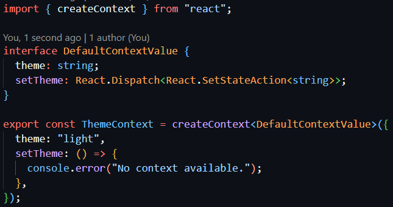
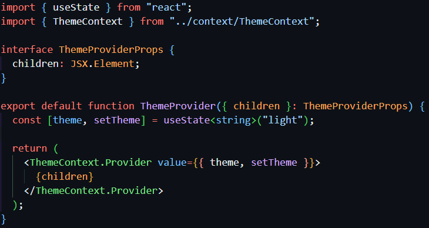
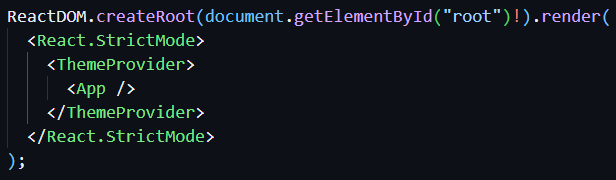
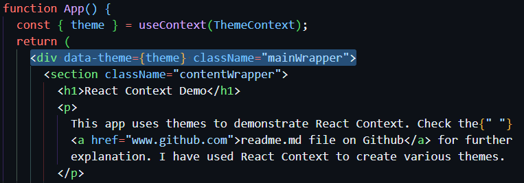
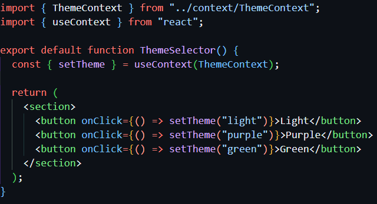
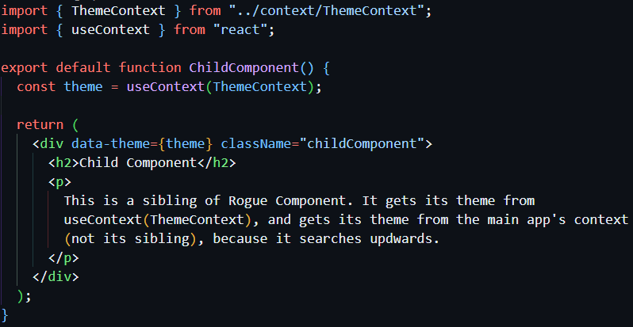
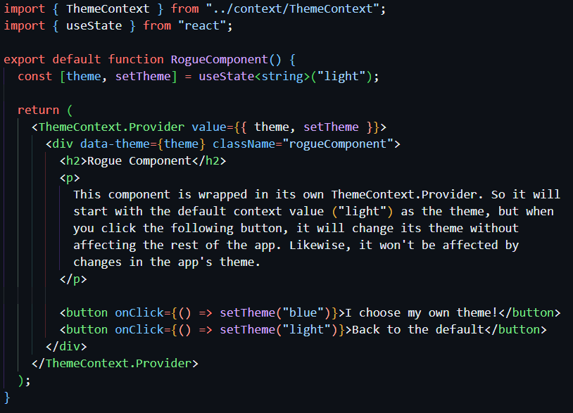

# React-Context-Playground

This is a simple app for understanding the usage of React Context.

React Context is a global state management system: a way to share data between components in an app without drilling through component props.

Context can be useful when data needs to be accessed by multiple components at different levels in the app component hierarchy.

The React documentation is fairly easy to follow for React Context:

- [createContext](https://react.dev/reference/react/createContext)
- [useContext](https://react.dev/reference/react/useContext#)

## App Structure

### src/context/ThemeContext.tsx

ThemeContext is created with default values.

### src/components/ThemeProvider.tsx

Provider component is created which includes the state value (theme) and the state setter (setTheme). This will wrap the entire app (as shown in main.tsx below).

### src/main.tsx

### src/App.tsx

The app retrieves **theme** with useContext() to set the theme for the app (using data-theme and CSS variables).

### src/components/ThemeSelector

The ThemeSelector retrieves **setTheme** with useContext() and can now use it to setThemes with buttons, without needing to pass setTheme as a prop from its parent, the App.

### src/components/ChildComponent

ChildComponent also retrieves **theme** with useContext(), so, again, we don't need to pass theme as a prop from its parent, the App.

### src/components/RogueComponent

RogueComponent, despite being a child of the App which is wrapped in the ThemeProvider, is wrapped in its own Provider:

The Provider **theme** and **setTheme** default values will be the same as the ThemeContext default values. But because this component has its own state, when **setTheme** is called, it will update the theme only for this Provider. So the RogueComponent theme will change, but this will not affect the App theme. Likewise, updating the App theme will not affect the RogueComponent theme.
