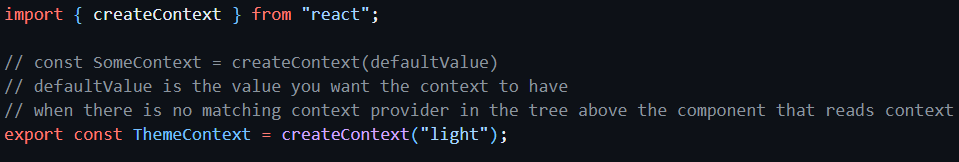

# React-Context-Playground

This is a simple app for understanding the usage of React Context.

React Context is a global state management system: a way to share data between components in an app without drilling through component props.

Context can be useful when data needs to be accessed by multiple components at different levels in the app component hierarchy.

The React documentation is fairly easy to follow for React Context:

- [createContext](https://react.dev/reference/react/createContext)
- [useContext](https://react.dev/reference/react/useContext#)

## App Structure

### ThemeContext

At `src/context/ThemeContext.tsx`, I've created ThemeContext using createContext():

### ThemeContext.Provider

The main app (App.tsx) is wrapped in ThemeContext.Provider to provide all components in the app access to the theme.
